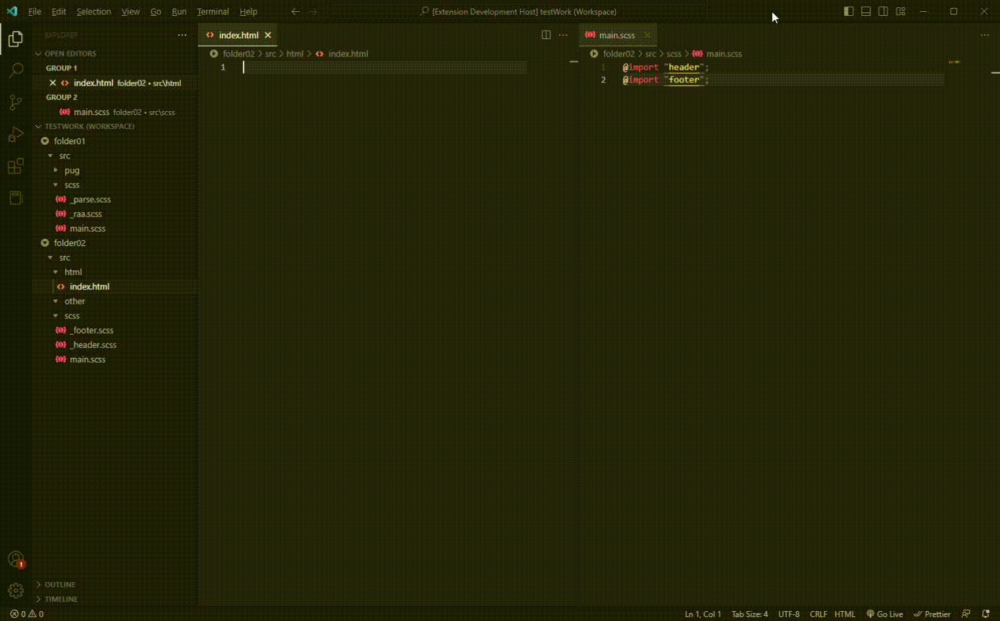

# AutoImport

Extension that automatically imports scss/sass partials into the specified main file.

- Support for creating, renaming, deleting, and moving partials.
- Ability to determine files that should always remain at the bottom of the import list
- Swap between scss / sass formatting or single / double quotes
- Support @use, @forwards instead of @imports

## How to use

- The folder where you import partials should only contain the partials and nothing else
- Make sure to choose your preferred relative path. A relative path is relative to the separate workspace folders
- You can use newPartialFile command to create new partials in your preferred location. You can specify custom subfolders. (Only type the file name ex. 'footer', 'parts/footer', ../footer)
- You can use newFileTemplate to set lines that will be pasted to the new partial.
- Template supports `${filename}` variable, replaced with the name entered by the user
- Template supports `${cursor}` marker to set the cursor position after the file opens; falls back to end of file if not set

